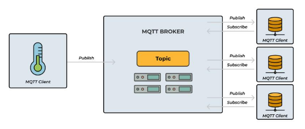
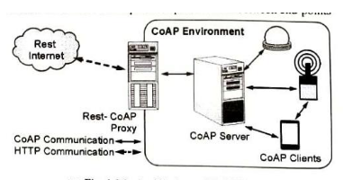

## 1. MQTT (Message Queing Telemetry Transport)
- Developed by IBM 1999

- Lightweight and Efficient protocol
- Made for networks Low Bandwidth and Low Power and Memory Devices

- Publish-Subscribe Model Communication
- Client-Broker Model Architecture
- Works over TCP/IP
- Topics are present for seperation of messages
    - Example: "home/livingroom/temperature"
- Components:
    - Publisher     - Sensors
        - Publisher can publish to different topics
    - Subscriber    - IOT Devies like Smartphones, Dashboards
        - Different topics, subscriber can subscriber to different topics as required
    - Broker        - MQTT Broker
        - Central MQTT Broker handler sending the apt messages forward to the subscriber
 

- MQTT Message Components:
    - Topic                         - The label or channel name.
    - Payload                       - Actual data (e.g., “Temperature = 27°C”).
    - QoS (Quality of Service)      - Defines message delivery assurance.

- Quality of Service (QoS) Levels
    - MQTT provides three QoS levels to balance reliability and performance:

    | QoS Level | Description | Use Case |
    | --------------- | --------------- | --------------- |
    | 0 - At most once | Message sent once, no acknowledgment. | Fast Updates |
    | 1 - At least once | Message delivered at least once (may duplicate). | Important Data |
    | 1 - Exactly once | Message delivered once and only once. | Critical Applications |

- Features
    - Lightweight, Reliable, Async Communication, Scalable, Secure

- Advantages
    - Efficient for low-bandwidth or high-latency networks.
    - Easy to implement and integrate with IoT cloud platforms (e.g., AWS IoT, Azure IoT).
    - Reduces network traffic through topic-based filtering.
    - Provides flexibility for both small-scale and large-scale IoT systems.

- Widely used for efficient networks

---

## 2. COAP (Constrained Application Protocol)
- Protocol for Low Power, Limited Memory, Unreliable Networks

- **REST** protocol but lighter with resource URIs and with UDP
- Has GET, POST, PUT, DELETE
- CoAP Architecture:
    - CoAP follows a Client–Server model similar to HTTP but optimized for IoT.
    - Client: Sends requests (GET, POST, PUT, DELETE) to access or modify resources on a server.
    - Server: Hosts resources (data from sensors, actuator states) and responds to client requests.
- Header has 4 bytes
 

- CoAP Message Types:

| Message Type | Purpose | Reliability |
| --- | --- | --- |
| Confirmable (CON) | Requires acknowledgment (ACK) from receiver. | Reliable |
| Non-confirmable (NON) | No acknowledgment needed. | Unreliable but faster |
| Acknowledgment (ACK) | Sent to confirm receipt of a CON message. | Reliable |
| Reset (RST) | Indicates message not understood or unexpected. | Error handling |

- Custom Reliability and Acknowledgement Mechanism
- Observe Mechanism
    - client subscribes to resource
    - server notifies client of the update when resource changes
- Block splitting when larger data is to be sent

- Advantages
    - Lightweight and suitable for low-power IoT devices.
    - Fast communication due to UDP usage.
    - Supports multicast communication (sending one message to many devices).
    - Easy integration with HTTP using proxies.

---

## 3. AMQP (Advanced Message Queing Transport)
- Message-oriented middleware protocol
- Reliable, secure, and interoperable messaging
- To provide reliable, secure, and interoperable messaging between applications (especially IoT and enterprise systems).

- Works over TCP/IP Protocol

- AMQP is an open-standard messaging protocol 
- It is designed to support:
    - Reliable queuing
    - Routing
    - Transaction support
    - Security
    - Store-and-forward messaging

- Uses a Broker-based architecture. The broker (message server) stores, routes, and delivers messages.
- **Main Components:**
    - **Producer (Sender):** The application that sends messages (e.g., a sensor).
    - **Broker:** The message server (e.g., RabbitMQ, Apache Qpid).
    - **Exchange:** Component inside the broker that routes messages to queues based on rules.
    - **Queue:** Stores messages until they are delivered to consumers.
    - **Binding:** The link (defining routing rules) between an exchange and a queue.
    - **Consumer (Receiver):** The application that receives messages from a queue (e.g., a dashboard).

- AMQP Message Flow (Step-by-Step Working)
    - Producer sends a message to the **Exchange** in the AMQP broker.
    - Exchange routes the message to one or more **Queues** based on routing rules (bindings).
    - Each Queue stores the message.
    - **Consumer** retrieves messages from the Queue.
    - Once processed, the consumer **acknowledges** message receipt.
    - The broker deletes the message from the queue *after* acknowledgment.

- Types of Exchanges in AMQP

| Exchange Type | Description | Example Use Case |
| :--- | :--- | :--- |
| **Direct** | Routes messages based on exact matching routing key. | Sending messages to a specific service. |
| **Fanout** | Broadcasts messages to all queues bound to it. | Sending notifications to multiple devices. |
| **Topic** | Routes messages based on pattern matching in the routing key. | IoT sensors (e.g., `temperature.*`). |
| **Headers** | Routes based on header attributes (not routing keys). | Complex routing based on message metadata. |

- Key Features of AMQP
    - **Message Orientation:** Exchanges data in discrete packets (messages).
    - **Reliability:** Messages are stored until safely delivered; supports acknowledgment and transactions.
    - **Security:** Uses TLS/SSL for secure communication and supports authentication.
    - **Interoperability:** Open-standard; works across different platforms and languages.
    - **Guaranteed Delivery:** Ensures messages reach the destination, even if a system is temporarily offline.
    - **Transaction Support:** Allows grouping multiple operations into a single atomic transaction.

- Advantages of AMQP
    - **Reliable Messaging:** Ensures no messages are lost (supports acknowledgment and persistence).
    - **Interoperability:** Open standard works across different vendors, OS, and languages.
    - **Flexible Routing:** Allows complex routing (direct, topic, fanout, headers).
    - **Security:** Provides end-to-end encryption and authentication (SSL/TLS).
    - **Asynchronous Communication:** Improves efficiency by allowing systems to send/receive without immediate responses.
    - **Transactional Support:** Supports atomic message transactions (vital for financial systems).
    - **Scalability:** Supports high message throughput.
    - **Persistence:** Messages can be stored on disk for durability.

- Applications of AMQP
    - **IoT Systems:** Connects sensors, gateways, and apps (e.g., smart agriculture).
    - **Banking and Finance:** Secure/guaranteed delivery of financial transactions (e.g., payment gateways).
    - **Enterprise Messaging:** Integrates distributed applications (e.g., ERP, CRM).
    - **Cloud Services:** Used for microservices communication (e.g., Microsoft Azure Service Bus).
    - **Supply Chain and Logistics:** Tracking, data sharing, and coordination.
    - **Healthcare:** Securely transfers sensitive patient data.
    - **Telecommunications:** Manages call routing, billing, and monitoring.

